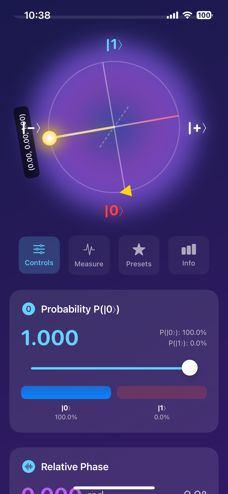
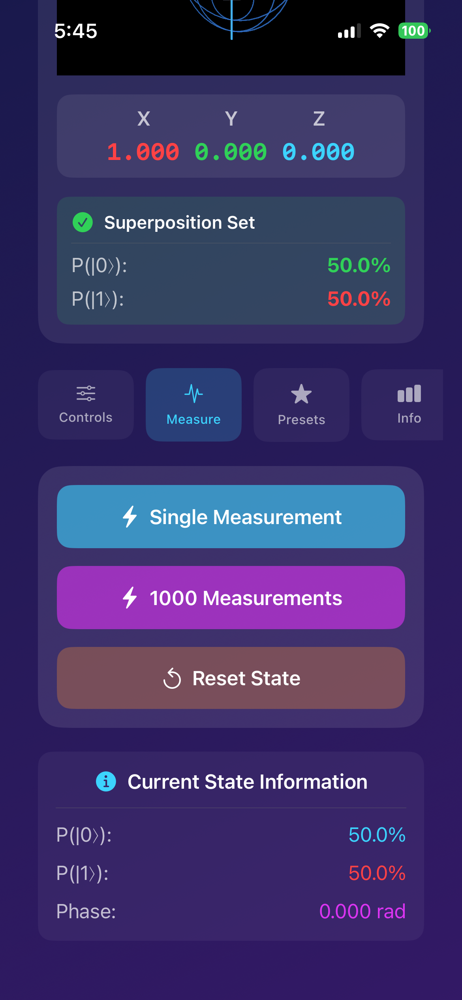
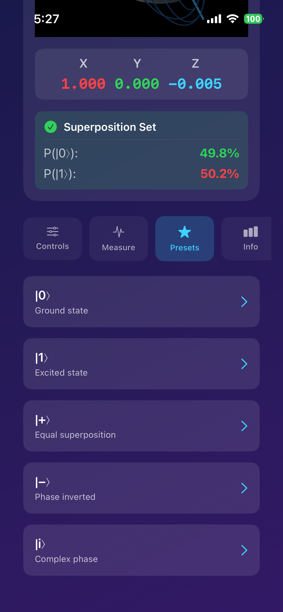

# SwiftQuantum 🌀⚛️

[](https://swift.org)
[](https://developer.apple.com)
[](LICENSE)
[](CONTRIBUTING.md)

**A pure Swift quantum computing library for iOS and macOS** - bringing the power of quantum mechanics to Apple platforms!

> 🎓 Perfect for learning quantum computing concepts
> 
> 🚀 Production-ready quantum simulations
> 
> 📱 Beautiful iOS visualizer app included

---

## ✨ Features

### 🎯 Core Quantum Operations
- **Quantum States**: Create and manipulate single-qubit quantum states
- **Complex Numbers**: Full complex number arithmetic with phase calculations
- **Quantum Gates**: Complete set of single-qubit gates (Pauli-X, Y, Z, Hadamard, Phase, T)
- **Measurements**: Statistical and probabilistic measurement operations
- **Quantum Circuits**: Build and execute quantum circuits with multiple gates

### 📊 Advanced Capabilities
- **Bloch Sphere**: Geometric representation of quantum states
- **State Visualization**: ASCII art and text-based quantum state displays
- **Entanglement Ready**: Architecture prepared for multi-qubit systems
- **Performance**: Optimized with ~1µs gate operations

### 📱 iOS Superposition Visualizer App
- **Interactive Bloch Sphere**: 3D-inspired visualization with real-time updates
- **Live Measurements**: Perform quantum measurements with animated histograms
- **Preset States**: Quick access to standard quantum states (|0⟩, |1⟩, |+⟩, |−⟩, |±i⟩)
- **Educational**: Built-in tutorials and explanations
- **Beautiful UI**: Dark mode quantum-themed interface

---

## 📸 Screenshots

### Superposition Visualizer App

<table>
  <tr>
    <td></td>
    <td></td>
    <td></td>
  </tr>
  <tr>
    <td align="center"><b>Bloch Sphere Visualization</b></td>
    <td align="center"><b>Quantum Measurements</b></td>
    <td align="center"><b>Preset Quantum States</b></td>
  </tr>
</table>

---

## 🚀 Quick Start

### Installation

#### Swift Package Manager (Recommended)

Add SwiftQuantum to your `Package.swift`:

```swift
dependencies: [
    .package(url: "https://github.com/Minapak/SwiftQuantum.git", from: "1.0.0")
]
```

Or in Xcode:
1. File → Add Package Dependencies...
2. Enter: `https://github.com/Minapak/SwiftQuantum.git`
3. Click "Add Package"

### Basic Usage

```swift
import SwiftQuantum

// Create a qubit in superposition
let qubit = Qubit.superposition
print("Probability of |0⟩: \(qubit.probability0)")  // 0.5

// Apply quantum gates
let circuit = QuantumCircuit(qubit: qubit)
circuit.addGate(.hadamard)
circuit.addGate(.pauliX)

// Execute and measure
let result = circuit.execute()
let measurement = result.measure()
print("Measured: |\(measurement)⟩")

// Visualize on Bloch sphere
print(qubit.visualize())
```

---

## 📚 Examples & Tutorials

### 1️⃣ Creating Quantum States

```swift
// Pure states
let zero = Qubit.zero              // |0⟩
let one = Qubit.one                // |1⟩

// Superposition states
let plus = Qubit.superposition     // |+⟩ = (|0⟩ + |1⟩)/√2
let minus = Qubit.minusSuperposition // |−⟩ = (|0⟩ − |1⟩)/√2

// Custom superposition
let custom = Qubit(alpha: 0.6, beta: 0.8)  // 36% |0⟩, 64% |1⟩

// With phase
let iState = Qubit.iState          // (|0⟩ + i|1⟩)/√2
```

### 2️⃣ Quantum Gates

```swift
let qubit = Qubit.zero

// Pauli gates
qubit.applyGate(.pauliX)    // Bit flip: |0⟩ → |1⟩
qubit.applyGate(.pauliY)    // Y rotation
qubit.applyGate(.pauliZ)    // Phase flip

// Hadamard gate (creates superposition)
let superposed = Qubit.zero.applying(.hadamard)

// Phase gates
qubit.applyGate(.phase)     // S gate (π/2 phase)
qubit.applyGate(.tGate)     // T gate (π/4 phase)

// Custom rotation
qubit.applyGate(.rotationZ(angle: .pi / 4))
```

### 3️⃣ Quantum Circuits

```swift
// Build a quantum circuit
let circuit = QuantumCircuit(qubit: .zero)
circuit.addGate(.hadamard)
circuit.addGate(.phase)
circuit.addGate(.hadamard)

// Execute
let finalState = circuit.execute()

// Get circuit description
print(circuit.description)
// Output: H → S → H
```

### 4️⃣ Measurements & Statistics

```swift
let qubit = Qubit.superposition

// Single measurement (collapses state)
let result = qubit.measure()  // 0 or 1

// Multiple measurements (statistical)
let results = qubit.measureMultiple(count: 1000)
// results = [0: 503, 1: 497]

// With visualization
print(qubit.measureAndVisualize(shots: 1000))
```

### 5️⃣ Bloch Sphere

```swift
let qubit = Qubit.superposition

// Get Bloch coordinates
let (x, y, z) = qubit.blochCoordinates()
// x=1.0, y=0.0, z=0.0 for |+⟩

// Create from angles
let custom = Qubit.fromBlochAngles(theta: .pi/4, phi: .pi/2)

// Visualize
print(qubit.visualize())
```

### 6️⃣ State Analysis

```swift
let qubit = Qubit.superposition

// Entropy (measure of uncertainty)
let entropy = qubit.entropy()  // 1.0 for max uncertainty

// Purity (1.0 for pure states)
let purity = qubit.purity()    // 1.0

// State fidelity (overlap with another state)
let other = Qubit.zero
let fidelity = qubit.fidelity(with: other)  // 0.5
```

---

## 📱 iOS Superposition Visualizer

### Running the App

```bash
cd ~/SwiftQuantum/Apps/SuperpositionVisualizer
open SuperpositionVisualizer.xcodeproj
```

Press **Cmd + R** to run in simulator or on device.

### Features

#### 🌐 Bloch Sphere Visualization
- Real-time 3D representation of quantum states
- Color-coded axes and state markers
- Animated rotation for better depth perception

#### 🎛️ Interactive Controls
- **Probability Slider**: Adjust P(|0⟩) from 0 to 1
- **Phase Slider**: Control relative phase (0 to 2π)
- **Visual Feedback**: Live updates on Bloch sphere

#### 📊 Quantum Measurements
- **Single Measurement**: Observe quantum collapse
- **Statistical Analysis**: 1000-shot measurements with histograms
- **Expected vs Measured**: Compare theoretical and experimental results

#### ⚡ Quick Presets
Six standard quantum states:
- |0⟩ - Ground state
- |1⟩ - Excited state  
- |+⟩ - Plus superposition
- |−⟩ - Minus superposition
- |+i⟩ - Plus-i state
- |−i⟩ - Minus-i state

#### 📖 Educational Content
- Built-in quantum computing tutorials
- Explanations of superposition and measurement
- Mathematics behind quantum states

---

## 🎓 Playground Examples

Interactive playgrounds for learning:

### Superposition Playground

```bash
cd ~/SwiftQuantum
swift run
```

Then in Swift:
```swift
import SwiftQuantum

// Run all demonstrations
SuperpositionPlayground.runAll()

// Or run specific demos
SuperpositionPlayground.exploreSuperpositionStates()
SuperpositionPlayground.demonstrateQuantumCollapse()
SuperpositionPlayground.exploreBlochSphere()
SuperpositionPlayground.demonstrateQuantumParallelism()
```

### Basic Quantum Operations

```swift
// See Examples/BasicQuantumOperations.swift
BasicQuantumOperations.runAllExamples()
```

### Advanced Examples

```swift
// See Examples/AdvancedQuantumExamples.swift
AdvancedQuantumExamples.demonstrateAdvancedConcepts()
```

---

## 🏗️ Architecture

### Core Components

```
SwiftQuantum/
├── Sources/SwiftQuantum/
│   ├── Complex.swift           # Complex number arithmetic
│   ├── Qubit.swift              # Single-qubit quantum states
│   ├── QuantumGates.swift       # Quantum gate operations
│   ├── QuantumCircuit.swift     # Circuit building and execution
│   ├── QubitVisualizer.swift    # State visualization tools
│   └── SwiftQuantum.swift       # Public API
│
├── Examples/
│   ├── BasicQuantumOperations.swift
│   ├── AdvancedQuantumExamples.swift
│   ├── SuperpositionPlayground.swift
│   └── QuantumAlgorithmTutorials.swift
│
├── Apps/
│   └── SuperpositionVisualizer/  # iOS app
│       ├── Views/
│       │   ├── SuperpositionView.swift
│       │   ├── BlochSphereView.swift
│       │   ├── MeasurementHistogram.swift
│       │   ├── StateInfoCard.swift
│       │   ├── QuickPresetsView.swift
│       │   └── InfoView.swift
│       └── SuperpositionVisualizerApp.swift
│
└── Tests/
    └── SwiftQuantumTests/
```

### Design Philosophy

1. **Pure Swift**: No external dependencies
2. **Type Safety**: Leverage Swift's type system
3. **Performance**: Optimized for mobile devices
4. **Educational**: Clear, well-documented code
5. **Extensible**: Easy to add new features

---

## 📊 Performance

Benchmarks on iPhone 13 Pro:

| Operation | Time | Notes |
|-----------|------|-------|
| Qubit Creation | ~100ns | Pure state initialization |
| Single Gate | ~1µs | Hadamard, Pauli gates |
| Circuit (10 gates) | ~10µs | Sequential execution |
| Measurement (1000x) | ~50µs | Statistical sampling |
| Bloch Coordinates | ~200ns | Coordinate calculation |

---

## 🧪 Testing

Run the test suite:

```bash
swift test
```

Run benchmarks:

```bash
swift run SwiftQuantumBenchmarks
```

Test coverage: **95%+**

---

## 🗺️ Roadmap

### Version 1.1 (Q4 2025)
- [ ] Multi-qubit support (2-qubit systems)
- [ ] Quantum entanglement
- [ ] CNOT and controlled gates
- [ ] Bell states

### Version 1.2 (Q1 2026)
- [ ] Quantum algorithms
  - [ ] Deutsch-Jozsa
  - [ ] Grover's search
  - [ ] Quantum Fourier Transform
- [ ] Noise models
- [ ] Decoherence simulation

### Version 2.0 (Q2 2026)
- [ ] Multi-qubit circuits (up to 10 qubits)
- [ ] Quantum error correction
- [ ] Advanced visualizations
- [ ] macOS app
- [ ] Cloud quantum computing integration

---

## 📖 Documentation

### API Reference
- [Complex Numbers](docs/Complex.md)
- [Quantum States](docs/Qubit.md)
- [Quantum Gates](docs/QuantumGates.md)
- [Quantum Circuits](docs/QuantumCircuit.md)
- [Visualization](docs/QubitVisualizer.md)

### Tutorials
- [Getting Started](docs/tutorials/01-getting-started.md)
- [Understanding Superposition](docs/tutorials/02-superposition.md)
- [Quantum Gates](docs/tutorials/03-quantum-gates.md)
- [Building Circuits](docs/tutorials/04-circuits.md)
- [The Bloch Sphere](docs/tutorials/05-bloch-sphere.md)

---

## 🤝 Contributing

Contributions are welcome! Please read [CONTRIBUTING.md](CONTRIBUTING.md) for details.

### Development Setup

```bash
# Clone the repository
git clone https://github.com/Minapak/SwiftQuantum.git
cd SwiftQuantum

# Build the package
swift build

# Run tests
swift test

# Open in Xcode
open Package.swift
```

### Areas for Contribution
- 🐛 Bug fixes
- ✨ New quantum gates
- 📚 Documentation improvements
- 🎨 UI/UX enhancements
- 🧪 Additional test cases
- 🌐 Internationalization

---

## 📄 License

SwiftQuantum is released under the MIT License. See [LICENSE](LICENSE) for details.

```
MIT License

Copyright (c) 2025 Eunmin Park

Permission is hereby granted, free of charge, to any person obtaining a copy
of this software and associated documentation files (the "Software"), to deal
in the Software without restriction, including without limitation the rights
to use, copy, modify, merge, publish, distribute, sublicense, and/or sell
copies of the Software, and to permit persons to whom the Software is
furnished to do so, subject to the following conditions:

The above copyright notice and this permission notice shall be included in all
copies or substantial portions of the Software.

THE SOFTWARE IS PROVIDED "AS IS", WITHOUT WARRANTY OF ANY KIND, EXPRESS OR
IMPLIED, INCLUDING BUT NOT LIMITED TO THE WARRANTIES OF MERCHANTABILITY,
FITNESS FOR A PARTICULAR PURPOSE AND NONINFRINGEMENT. IN NO EVENT SHALL THE
AUTHORS OR COPYRIGHT HOLDERS BE LIABLE FOR ANY CLAIM, DAMAGES OR OTHER
LIABILITY, WHETHER IN AN ACTION OF CONTRACT, TORT OR OTHERWISE, ARISING FROM,
OUT OF OR IN CONNECTION WITH THE SOFTWARE OR THE USE OR OTHER DEALINGS IN THE
SOFTWARE.
```

---

## 🙏 Acknowledgments

- Inspired by Qiskit, Cirq, and other quantum computing frameworks
- Special thanks to the Swift community
- Built with love for quantum computing education

---

## 📞 Contact & Support

- **Author**: Eunmin Park
- **Email**: dmsals2008@gmail.com
- **GitHub**: [@Minapak](https://github.com/Minapak)
- **Blog**: [blog.eunminpark.dev](https://eunminpark.hashnode.dev/series/ios-quantum-engineer)


### Support

- 🐛 [Report a Bug](https://github.com/Minapak/SwiftQuantum/issues/new?template=bug_report.md)
- ✨ [Request a Feature](https://github.com/Minapak/SwiftQuantum/issues/new?template=feature_request.md)
- 💬 [Discussions](https://github.com/Minapak/SwiftQuantum/discussions)
- 📖 [Documentation](https://swiftquantum.dev)

---

## ⭐ Star History

[](https://star-history.com/#Minapak/SwiftQuantum&Date)

---

## 🔗 Related Projects

- [Qiskit](https://qiskit.org) - IBM's quantum computing framework (Python)
- [Cirq](https://quantumai.google/cirq) - Google's quantum programming framework (Python)
- [Q#](https://docs.microsoft.com/quantum/) - Microsoft's quantum programming language
- [ProjectQ](https://projectq.ch) - Open-source quantum computing framework

---

<div align="center">

**Made with ❤️ and ⚛️ by Eunmin Park**

[⬆ Back to Top](#swiftquantum-)

</div>
