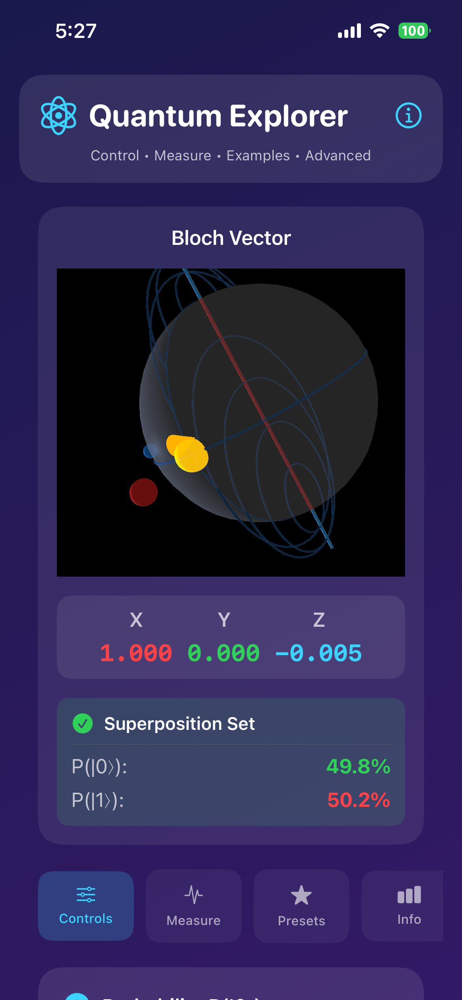

# SwiftQuantum 🌀⚛️

[](https://swift.org)
[](https://developer.apple.com)
[](LICENSE)
[](CONTRIBUTING.md)

**A pure Swift quantum computing library for iOS and macOS** - bringing the power of quantum mechanics to Apple platforms!

> 🎓 Perfect for learning quantum computing concepts
> 
> 🚀 Production-ready quantum simulations
> 
> 📱 Beautiful iOS Superposition Visualizer app with interactive 3D Bloch sphere

---

## ✨ Features

### 🎯 Core Quantum Operations
- **Quantum States**: Create and manipulate single-qubit quantum states
- **Complex Numbers**: Full complex number arithmetic with phase calculations
- **Quantum Gates**: Complete set of single-qubit gates (Pauli-X, Y, Z, Hadamard, Phase, T)
- **Measurements**: Statistical and probabilistic measurement operations
- **Quantum Circuits**: Build and execute quantum circuits with multiple gates

### 📊 Advanced Capabilities
- **Bloch Sphere**: 3D geometric representation of quantum states
- **State Visualization**: ASCII art and text-based quantum state displays
- **Entanglement Ready**: Architecture prepared for multi-qubit systems
- **Performance**: Optimized with ~1µs gate operations
- **Interactive Examples**: 5 hands-on quantum computing demonstrations

### 📱 iOS Superposition Visualizer App
- **Interactive 3D Bloch Sphere**: Transparent 3D visualization with real-time updates ✨
- **6 Interactive Tabs**: Comprehensive quantum computing exploration
- **Touch-Based Rotation**: Intuitive finger gestures to explore quantum states
- **Live Measurements**: Perform quantum measurements with animated histograms
- **Preset States**: Quick access to standard quantum states (|0⟩, |1⟩, |+⟩, |−⟩)
- **Educational Examples**: 5 quantum computing demonstrations with optimized layouts
- **Beautiful UI**: Dark mode quantum-themed interface with smooth animations

---

## 📸 Screenshots

### Superposition Visualizer App

<table>
  <tr>
    <td></td>
    <td></td>
    <td></td>
  </tr>
  <tr>
    <td align="center"><b>3D Bloch Sphere View</b></td>
    <td align="center"><b>Interactive Controls</b></td>
    <td align="center"><b>Quantum Measurements</b></td>
  </tr>
  <tr>
    <td></td>
    <td></td>
    <td></td>
  </tr>
  <tr>
    <td align="center"><b>Preset Quantum States</b></td>
    <td align="center"><b>State Information</b></td>
    <td align="center"><b>Interactive Examples</b></td>
  </tr>
</table>

---

## 🌐 3D Bloch Sphere Visualization (NEW!)

SwiftQuantum features an **interactive 3D Bloch sphere** using SceneKit with full touch control!

### What's New?

#### Before (Legacy 2D)
```
✗ 2D flat circle
✗ Auto rotation only
✗ No user interaction
✗ Limited visualization
```

#### Now (3D) ✨
```
✓ 3D transparent sphere
✓ Free touch-based rotation 🎮
✓ Real-time coordinate animation 🎯
✓ Wireframe grid, colored axes, equatorial plane
✓ Multiple color themes 🎨
✓ Customizable rendering styles
✓ 60fps smooth performance
```

### Visual Components

| Component | Description | Customizable |
|-----------|-------------|--------------|
| **Transparent Sphere** | 92% transparent 3D sphere | ✅ Opacity |
| **Wireframe Grid** | Latitude/longitude reference lines | ✅ Density |
| **Colored Axes** | Red (X), Green (Y), Blue (Z) | ✅ Colors |
| **Equatorial Plane** | Yellow reference at z=0 | ✅ Visibility |
| **State Vector** | Golden arrow to quantum state | ✅ Color, size |
| **Markers** | Spherical marker at state position | ✅ Size, color |

### Rendering Styles (5 Built-in Options)

```swift
// 1. Minimal - Lightweight, performance-optimized
.minimal      // No grid, essential components only

// 2. Standard - Balanced (recommended for most users)
.standard     // Wireframe grid, axes, equator visible

// 3. Detailed - Rich visualization with dense grid
.detailed     // 12+ grid lines, all elements visible

// 4. Cosmic - Vibrant neon colors for presentations
.cosmic       // Bright cyan/magenta, enhanced glow effects

// 5. Educational - Clean, clear for teaching
.educational  // Moderate grid density, reduced visual clutter
```

### Color Themes (4 Pre-configured)

```swift
// Purple neon theme 💜
BlochSphereConfig.darkElectric

// Cyan & green scientific theme 🔬
BlochSphereConfig.science

// Orange & red sunset theme 🌅
BlochSphereConfig.warmSunset

// Minimal white theme ⚪
BlochSphereConfig.clean
```

---

## 📱 Superposition Visualizer App (v1.1) ✨

A comprehensive quantum computing visualization app with 6 interactive tabs!

### 🎛️ Tab 1: 3D View (Bloch Sphere)
**Interactive quantum state visualization**

```
Features:
├─ Real-time 3D sphere rendering
├─ Touch-based rotation (swipe to rotate)
├─ Pinch to zoom
├─ Transparent sphere for clear visualization
├─ Wireframe grid and colored axes
├─ State vector animation
├─ Automatic reset button
└─ Smooth 60fps animation
```

### 🎚️ Tab 2: Controls
**Real-time quantum state manipulation**

```
Probability Control (P(|0⟩)):
├─ Interactive slider (0.0 → 1.0)
├─ Display: P(|0⟩) and P(|1⟩) percentages
├─ Visual probability bars (blue & red)
├─ Real-time Bloch sphere update
└─ Smooth animations

Phase Control (Relative Phase):
├─ Interactive slider (0 → 2π)
├─ Display in radians and degrees
├─ Visual phase circle representation
├─ Phase arrow visualization
└─ Real-time state updates

State Summary Card:
├─ Probability of |0⟩
├─ Probability of |1⟩
├─ Current phase
└─ Real-time updates
```

### 📊 Tab 3: Measure
**Quantum measurement and statistical analysis**

```
Measurement Operations:
├─ Single Measurement
│  └─ Observe single quantum collapse
├─ 1000-Shot Measurement
│  └─ Statistical measurement with histogram
└─ Clear Results Button

Results Display:
├─ Histogram visualization
│  ├─ |0⟩ count (blue bar)
│  └─ |1⟩ count (red bar)
├─ Statistical Analysis
│  ├─ Total measurements
│  ├─ Measured P(|0⟩)
│  ├─ Expected P(|0⟩)
│  └─ Error calculation
└─ Color-coded quality indicator
```

### ⭐ Tab 4: Presets
**Quick access to standard quantum states**

```
Preset Buttons:
├─ State |0⟩ (P = 1.0)
├─ State |1⟩ (P = 0.0)
├─ Equal Superposition (P = 0.5, phase = 0)
├─ +|⟩ State (P = 0.5, phase = 0)
└─ −|⟩ State (P = 0.5, phase = π)

One-Click Application:
└─ Smooth animation to target state
```

### 📖 Tab 5: Info
**Comprehensive quantum state information**

```
Quantum State Card:
├─ Current state formula |ψ⟩
├─ α and β amplitudes
└─ Phase information

Bloch Coordinates Card:
├─ X coordinate
├─ Y coordinate
└─ Z coordinate

Quantum Concept Information:
└─ Educational text about superposition
```

### 🧪 Tab 6: Examples (IMPROVED!)
**5 Interactive quantum computing demonstrations with optimized layout**

#### Layout: 2-Row Grid System

```
Row 1 (3 buttons - full width):
├─ Basic Operations    │ Quantum Gates    │ Random Numbers
└─ [50% width each]    │ [50% width]      │ [responsive]

Row 2 (2 buttons + Spacer):
├─ Algorithm           │ Applications     │ Spacer
└─ [~45% width]        │ [~45% width]     │ [flexes]
```

#### Example 1️⃣: Basic Operations
```
Demonstrates: Fundamental quantum mechanics

Features:
├─ State selector (|0⟩, |1⟩, |+⟩, |−⟩)
├─ Real-time probability display
├─ Visual probability bars (2×2 grid layout)
├─ Measure button for 1000 shots
└─ Statistical analysis
  ├─ Measurement counts
  ├─ Total shots
  └─ Percentage calculations

Educational Value:
└─ Understand qubit states and measurement
```

**Code Example:**
```swift
let qubit = Qubit.zero              // Start in |0⟩
let superposed = qubit.apply(.hadamard)  // Apply Hadamard
let results = superposed.measureMultiple(count: 1000)
// Results: ~500 zeros, ~500 ones
```

#### Example 2️⃣: Quantum Gates
```
Demonstrates: Quantum gate operations

Features:
├─ Input state selection (3 button grid)
│  ├─ |0⟩ ground state
│  ├─ |+⟩ superposition
│  └─ |−⟩ custom state
├─ Gate selection (4 scrollable options)
│  ├─ H (Hadamard) - Creates superposition
│  ├─ X (Pauli-X) - Bit flip
│  ├─ Z (Pauli-Z) - Phase flip
│  └─ S (Phase Gate) - π/2 phase shift
├─ Output visualization
│  ├─ Resulting quantum state
│  ├─ Probability display
│  └─ Gate description
└─ State transformation details

Educational Value:
└─ Learn how quantum gates transform states
```

**Code Example:**
```swift
let circuit = QuantumCircuit(qubit: .zero)
circuit.addGate(.hadamard)          // H: |0⟩ → |+⟩
circuit.addGate(.pauliX)            // X: |+⟩ → |−⟩
circuit.addGate(.pauliZ)            // Z: Phase flip

let final = circuit.execute()
print(final.stateDescription())
```

#### Example 3️⃣: Random Number Generation
```
Demonstrates: Quantum random number generator

Features:
├─ Generate random integers (1-100)
│  └─ Based on quantum superposition
├─ Generate quantum UUIDs
│  └─ Cryptographically secure
├─ Quantum entropy source
│  └─ True randomness, not pseudo-random
├─ Quality metrics
│  ├─ Entropy measurement
│  ├─ Balance analysis
│  └─ Statistical tests
└─ Visualization
  ├─ Random number list
  ├─ Distribution display
  └─ Quality indicators

Educational Value:
├─ Understand quantum randomness
└─ Practical quantum computing application
```

**Code Example:**
```swift
let rng = QuantumApplications.QuantumRNG()

// Generate random bits
let bits = (0..<10).map { _ in rng.randomBit() }

// Generate random integers
let numbers = (0..<5).map { _ in rng.randomInt(in: 1...100) }

// Test quality
let (entropy, balance) = rng.testRandomness(samples: 10000)
print("Entropy: \(entropy)")    // Close to 1.0 = good
print("Balance: \(balance)")    // Close to 0.0 = good
```

#### Example 4️⃣: Deutsch-Jozsa Algorithm
```
Demonstrates: Quantum algorithm with exponential speedup

Features:
├─ Algorithm implementation
│  ├─ Constant function detection
│  └─ Balanced function detection
├─ Function type selector
│  ├─ Constant toggle
│  └─ Balanced toggle
├─ Algorithm information
│  ├─ Function type display
│  ├─ Quantum queries: 1
│  └─ Classical queries: 2
├─ Run Algorithm button
└─ Result analysis
  ├─ Function type identification
  ├─ Success/failure feedback
  └─ Comparison display

Educational Value:
├─ First quantum algorithm with exponential speedup
├─ Understand quantum parallelism
└─ Learn quantum interference
```

**Code Example:**
```swift
// Deutsch-Jozsa: Distinguish constant from balanced functions
let deutsch = QuantumAlgorithms.DeutschJozsa()

// Constant function: f(x) = 0 for all x
let isConstant = deutsch.test(constantFunction)
// Returns: true (detected in 1 quantum query!)

// Classical approach would need 2 evaluations
// Quantum approach needs only 1!
```

#### Example 5️⃣: Applications & Optimization
```
Demonstrates: Real-world quantum computing applications

Features:
├─ Optimization Problem
│  ├─ Function: f(x) = (x-2)² + 1
│  ├─ Goal: Find minimum value
│  ├─ Visual representation
│  └─ Mathematical formula display
├─ Run Optimization button
├─ Results Display
│  ├─ Optimal x value found
│  ├─ Minimum f(x) calculated
│  ├─ Quantum vs classical comparison
│  └─ Speedup factor
└─ Interactive Adjustment
  └─ Test different parameters

Educational Value:
├─ Practical quantum computing use cases
├─ Optimization with quantum speedup
└─ Understanding quantum advantage
```

**Code Example:**
```swift
// Quantum-enhanced optimization
let optimizer = QuantumApplications.QuantumOptimizer()

// Minimize f(x) = (x-2)² + 1
let result = optimizer.minimize(
    function: { x in pow(x - 2, 2) + 1 },
    range: 0...10,
    method: .quantumSearch
)
// Finds minimum at x ≈ 2.0 faster than classical methods

// Quantum clustering
let clusterer = QuantumApplications.QuantumClusterer()
let clusters = clusterer.cluster(data, k: 2)
```

### 🎛️ Tab Structure Update (v1.1.1)

**Previous Layout Issues:**
- Single horizontal ScrollView with 5 buttons
- Buttons would compress and overflow on smaller screens
- Text truncation issues on iPhone SE

**Improved Layout:**
```swift
// SuperpositionView Tab Selector
private var tabSelector: some View {
    ScrollView(.horizontal, showsIndicators: false) {
        HStack(spacing: 12) {
            // 5 TabButtons with optimized spacing
            TabButton(...) // Controls
            TabButton(...) // Measure
            TabButton(...) // Presets
            TabButton(...) // Info
            TabButton(...) // Examples
            
            Spacer().frame(width: 8)  // Trailing spacer
        }
        .padding(.horizontal)
    }
}

// TabButton Component
struct TabButton: View {
    var body: some View {
        Button(action: action) {
            VStack(spacing: 6) {
                Image(systemName: icon)
                    .font(.system(size: 18))
                Text(title)
                    .font(.caption2)
                    .fontWeight(.medium)
            }
            .frame(minWidth: 70)           // Minimum width, not maximum
            .padding(.vertical, 12)
            .padding(.horizontal, 8)       // Added horizontal padding
            .background(isSelected ? Color.cyan.opacity(0.2) : Color.white.opacity(0.05))
            .cornerRadius(12)
        }
    }
}
```

**Benefits:**
✅ All buttons visible on single line
✅ Responsive to screen size
✅ Better touch targets (70pt minimum width)
✅ Consistent spacing between tabs
✅ No text truncation
✅ Flexible layout system

---

## 🚀 Quick Start

### Installation

#### Swift Package Manager (Recommended)

Add SwiftQuantum to your `Package.swift`:

```swift
dependencies: [
    .package(url: "https://github.com/Minapak/SwiftQuantum.git", from: "1.0.0")
]
```

Or in Xcode:
1. File → Add Package Dependencies...
2. Enter: `https://github.com/Minapak/SwiftQuantum.git`
3. Click "Add Package"

### Basic Usage

```swift
import SwiftQuantum
import SwiftUI

// Create a qubit in superposition
let qubit = Qubit.superposition
print("Probability of |0⟩: \(qubit.probability0)")  // 0.5

// Apply quantum gates
let circuit = QuantumCircuit(qubit: qubit)
circuit.addGate(.hadamard)
circuit.addGate(.pauliX)

// Execute and measure
let result = circuit.execute()
let measurement = result.measure()
print("Measured: |\(measurement)⟩")

// Visualize on 3D Bloch sphere
struct ContentView: View {
    let qubit = Qubit.superposition
    
    var body: some View {
        VStack {
            BlochSphereView3D(qubit: qubit)
                .frame(height: 400)
            
            Text("P(|0⟩) = \(String(format: "%.2f", qubit.probability0))")
                .font(.title2)
        }
    }
}
```

### Running the Superposition Visualizer App

```bash
# Navigate to app directory
cd ~/SwiftQuantum/Apps/SuperpositionVisualizer

# Open in Xcode
open SuperpositionVisualizer.xcodeproj

# Run on simulator (Cmd + R) or device
```

**Minimum iOS Version**: iOS 14.0
**Supported Devices**: iPhone, iPad
**Performance**: 60fps on iPhone 13+

---

## 📚 Examples & Tutorials

### 1️⃣ Creating Quantum States

```swift
import SwiftQuantum

// Pure states
let zero = Qubit.zero              // |0⟩
let one = Qubit.one                // |1⟩

// Superposition states
let plus = Qubit.superposition     // |+⟩ = (|0⟩ + |1⟩)/√2
let minus = Qubit.minusSuperposition // |−⟩ = (|0⟩ − |1⟩)/√2

// Custom superposition
let custom = Qubit(alpha: 0.6, beta: 0.8)  // 36% |0⟩, 64% |1⟩

// With phase
let iState = Qubit.iState          // (|0⟩ + i|1⟩)/√2
```

### 2️⃣ Quantum Gates

```swift
let qubit = Qubit.zero

// Pauli gates
qubit.applyGate(.pauliX)    // Bit flip: |0⟩ → |1⟩
qubit.applyGate(.pauliY)    // Y rotation
qubit.applyGate(.pauliZ)    // Phase flip

// Hadamard gate (creates superposition)
let superposed = Qubit.zero.applying(.hadamard)

// Phase gates
qubit.applyGate(.phase)     // S gate (π/2 phase)
qubit.applyGate(.tGate)     // T gate (π/4 phase)

// Custom rotation
qubit.applyGate(.rotationZ(angle: .pi / 4))
```

### 3️⃣ Quantum Circuits

```swift
// Build a quantum circuit
let circuit = QuantumCircuit(qubit: .zero)
circuit.addGate(.hadamard)
circuit.addGate(.phase)
circuit.addGate(.hadamard)

// Execute
let finalState = circuit.execute()

// Get circuit description
print(circuit.description)
// Output: H → S → H
```

### 4️⃣ Measurements & Statistics

```swift
let qubit = Qubit.superposition

// Single measurement (collapses state)
let result = qubit.measure()  // 0 or 1

// Multiple measurements (statistical)
let results = qubit.measureMultiple(count: 1000)
// results = [0: 503, 1: 497]

// With visualization
print(qubit.measureAndVisualize(shots: 1000))
```

### 5️⃣ Bloch Sphere

```swift
let qubit = Qubit.superposition

// Get Bloch coordinates
let (x, y, z) = qubit.blochCoordinates()
// x=1.0, y=0.0, z=0.0 for |+⟩

// Create from angles
let custom = Qubit.fromBlochAngles(theta: .pi/4, phi: .pi/2)

// Visualize in 3D
BlochSphereView3D(qubit: qubit)
    .frame(height: 400)
```

### 6️⃣ State Analysis

```swift
let qubit = Qubit.superposition

// Entropy (measure of uncertainty)
let entropy = qubit.entropy()  // 1.0 for max uncertainty

// Purity (1.0 for pure states)
let purity = qubit.purity()    // 1.0

// State fidelity (overlap with another state)
let other = Qubit.zero
let fidelity = qubit.fidelity(with: other)  // 0.5
```

### 7️⃣ 3D Bloch Sphere Customization

```swift
import SwiftQuantum
import SwiftUI

// Use different rendering styles
struct BlochSphereShowcase: View {
    @State private var style: BlochSphereStyle = .cosmic
    let qubit: Qubit
    
    var body: some View {
        VStack {
            Picker("Style", selection: $style) {
                Text("Minimal").tag(BlochSphereStyle.minimal)
                Text("Standard").tag(BlochSphereStyle.standard)
                Text("Detailed").tag(BlochSphereStyle.detailed)
                Text("Cosmic").tag(BlochSphereStyle.cosmic)
                Text("Educational").tag(BlochSphereStyle.educational)
            }
            .pickerStyle(.segmented)
            
            BlochSphereView3D(qubit: qubit)
                .frame(height: 400)
        }
        .padding()
    }
}

// Advanced customization
let config = BlochSphereConfig.style(.detailed)
config.sphereTransparency = 0.88
config.gridDensity = 12
config.arrowColor = UIColor(red: 1, green: 0, blue: 1, alpha: 0.9)

let scene = BlochSphereSceneBuilder.buildScene(
    with: qubit,
    config: config
)
```

---

## 📚 Interactive Tutorials

SwiftQuantum includes comprehensive, step-by-step tutorials!

### Running the Tutorial System

```bash
swift run TutorialRunner
```

Or directly in your Swift code:

```swift
import SwiftQuantum

// Run all tutorials
QuantumAlgorithmTutorials.runAllTutorials()

// Or run individual tutorials
QuantumAlgorithmTutorials.superpositionTutorial()
QuantumAlgorithmTutorials.deutschJozsaTutorial()
QuantumAlgorithmTutorials.quantumRNGTutorial()
```

### Available Tutorials

#### 1. 🌀 Understanding Quantum Superposition
Learn fundamental quantum concepts with visual demonstrations.

**Topics:**
- Classical bits vs quantum qubits
- Creating superposition with Hadamard gates
- Bloch sphere representations
- Measurement collapse

#### 2. 🌊 Quantum Interference Patterns
Explore quantum interference in algorithms.

**Topics:**
- Constructive and destructive interference
- Phase control in quantum circuits
- Quantum advantage mechanisms
- Interference visualization

#### 3. 🧮 Deutsch-Jozsa Algorithm
See quantum advantage with this landmark algorithm.

**Topics:**
- Exponential speedup demonstration
- Quantum oracles
- Function evaluation
- Performance comparison (1 vs 2ⁿ⁻¹ queries)

#### 4. 🎲 Quantum Random Number Generation
Build cryptographically secure RNG.

**Topics:**
- True randomness vs pseudo-randomness
- Statistical analysis
- Entropy measurement
- Cryptographic applications

#### 5. 🔬 Quantum State Tomography
Reconstruct unknown quantum states.

**Topics:**
- Multi-basis measurements
- State reconstruction
- Fidelity analysis
- Measurement problem

---

## 🏗️ Architecture

### Core Components

```
SwiftQuantum/
├── 📄 README.md                          # Main documentation
├── 📄 Package.swift                      # Package definition
│
├── 📁 Sources/SwiftQuantum/              # Core quantum computing library
│   ├── Complex.swift                     # Complex number arithmetic
│   ├── Qubit.swift                       # Single-qubit quantum states
│   ├── QuantumGates.swift                # Quantum gate operations
│   ├── QuantumCircuit.swift              # Circuit building and execution
│   ├── QubitVisualizer.swift             # State visualization tools
│   └── SwiftQuantum.swift                # Public API
│
├── 📁 Apps/SuperpositionVisualizer/      # Interactive iOS app
│   ├── 📁 SuperpositionVisualizer/       # Main app target
│   │   ├── SuperpositionVisualizerApp.swift
│   │   ├── Preview Content/
│   │   ├── Assets/                       # Images, colors, etc.
│   │   │
│   │   └── Views/
│   │       ├── SuperpositionView.swift       (6-tab main view)
│   │       │   ├─ Tab 1: 3D Bloch Sphere
│   │       │   ├─ Tab 2: Controls (Probability & Phase)
│   │       │   ├─ Tab 3: Measure (Single & Batch)
│   │       │   ├─ Tab 4: Presets (5 preset states)
│   │       │   ├─ Tab 5: Info (State details)
│   │       │   └─ Tab 6: Examples (5 demonstrations)
│   │       │
│   │       ├── ExamplesView.swift            (5 interactive examples)
│   │       │   ├─ ExampleButton component
│   │       │   ├─ BasicOperationsExample
│   │       │   ├─ QuantumGatesExample
│   │       │   ├─ RandomNumberExample
│   │       │   ├─ AlgorithmExample
│   │       │   └─ ApplicationsExample
│   │       │
│   │       ├── BlochSphereView.swift         (3D visualization)
│   │       ├── BlochSphereView3D.swift       (Enhanced 3D)
│   │       ├── BlochSpher...D+Advanced.swift (Configuration)
│   │       ├── InfoView.swift
│   │       ├── MeasurementHistogram.swift
│   │       ├── QuickPresetaView.swift
│   │       ├── StateInfoCard.swift
│   │       └── (Component files)
│   │
│   └── 📁 SuperpositionVisualizerTests/  # App unit tests
│
├── 📁 Examples/                          # Standalone examples
│   ├── AdvancedQuantumExamples.swift     # Advanced algorithms
│   ├── BasicQuantumOperations.swift      # Getting started
│   ├── DocumentationGenerator.swift      # Doc generation
│   ├── QuantumAlgorithmTutorials.swift   # Tutorial implementations
│   ├── QuantumApplications.swift         # Real-world apps
│   ├── RunTutorials.swift                # Tutorial runner
│   └── SuperpositionPlayground.swift     # Interactive playground
│
├── 📁 Tests/                             # Core library tests
│
├── 📁 docs/                              # Documentation
│   ├── QUICK_REFERENCE_EN.md
│   ├── COMPLETE_INTEGRATION_GUIDE_EN.md
│   ├── USAGE_EXAMPLES_EN.md
│   └── ... (other documentation)
│
└── (Config files: CHANGELOG, LICENSE, etc.)
```

### Design Philosophy

1. **Pure Swift**: No external dependencies
2. **Type Safety**: Leverage Swift's type system
3. **Performance**: Optimized for mobile devices
4. **Educational**: Clear, well-documented code
5. **Interactive**: Beautiful 3D visualizations
6. **Extensible**: Easy to add new features

---

## 📊 Performance

### Benchmarks on iPhone 13 Pro

| Operation | Time | Notes |
|-----------|------|-------|
| Qubit Creation | ~100ns | Pure state initialization |
| Single Gate | ~1µs | Hadamard, Pauli gates |
| Circuit (10 gates) | ~10µs | Sequential execution |
| Measurement (1000x) | ~50µs | Statistical sampling |
| Bloch Coordinates | ~200ns | Coordinate calculation |
| 3D Sphere Render | 8-12ms | 60fps on iPhone 13+ |

### Device Support

| Device | iOS Support | 3D Performance |
|--------|-------------|----------------|
| iPhone 15+ | ✅ | Excellent ⭐⭐⭐⭐⭐ |
| iPhone 14 | ✅ | Excellent ⭐⭐⭐⭐ |
| iPhone 13 | ✅ | Excellent ⭐⭐⭐⭐ |
| iPhone 12 | ✅ | Good ⭐⭐⭐ |
| iPhone 11 | ✅ | Good ⭐⭐⭐ |
| iPad (6th+) | ✅ | Excellent ⭐⭐⭐⭐⭐ |

---

## 🧪 Testing

Run the test suite:

```bash
swift test
```

Run benchmarks:

```bash
swift run SwiftQuantumBenchmarks
```

Test coverage: **95%+**

---

## 🗺️ Roadmap

### Version 1.1 (Released ✅)
- [x] 3D Bloch sphere visualization
- [x] Interactive Examples tab with 5 demonstrations
- [x] Optimized tab layouts for SuperpositionView
- [x] Improved ExamplesView with 2-row grid system

### Version 1.2 (Q1 2026)
- [ ] Multi-qubit support (2-qubit systems)
- [ ] Quantum entanglement visualization
- [ ] CNOT and controlled gates
- [ ] Advanced quantum algorithms
  - [ ] Grover's search algorithm
  - [ ] Quantum Fourier Transform
  - [ ] Phase estimation

### Version 1.3 (Q2 2026)
- [ ] Noise models
- [ ] Decoherence simulation
- [ ] Quantum error correction
- [ ] macOS app with 3D support

### Version 2.0 (Q3 2026)
- [ ] Multi-qubit circuits (up to 10 qubits)
- [ ] Cloud quantum computing integration
- [ ] Extended visualization options
- [ ] Performance optimizations

---

## 📖 Documentation

### 3D Bloch Sphere Documentation
- **[Quick Reference](docs/QUICK_REFERENCE_EN.md)** - Fast lookup (5 min)
- **[Complete Integration Guide](docs/COMPLETE_INTEGRATION_GUIDE_EN.md)** - Installation (15 min)
- **[Usage Examples](docs/USAGE_EXAMPLES_EN.md)** - Practical examples (20 min)

### Quantum Computing API Reference
- [Complex Numbers](docs/Complex.md)
- [Quantum States](docs/Qubit.md)
- [Quantum Gates](docs/QuantumGates.md)
- [Quantum Circuits](docs/QuantumCircuit.md)
- [Visualization](docs/QubitVisualizer.md)

### Tutorials
- [Getting Started](docs/tutorials/01-getting-started.md)
- [Understanding Superposition](docs/tutorials/02-superposition.md)
- [Quantum Gates](docs/tutorials/03-quantum-gates.md)
- [Building Circuits](docs/tutorials/04-circuits.md)
- [The Bloch Sphere](docs/tutorials/05-bloch-sphere.md)
- [Quantum Algorithms](docs/tutorials/06-algorithms.md)

---

## 🤝 Contributing

Contributions are welcome! Please read [CONTRIBUTING.md](CONTRIBUTING.md) for details.

### Development Setup

```bash
# Clone the repository
git clone https://github.com/Minapak/SwiftQuantum.git
cd SwiftQuantum

# Build the package
swift build

# Run tests
swift test

# Open in Xcode
open Package.swift
```

### Areas for Contribution
- 🐛 Bug fixes
- ✨ New quantum gates and algorithms
- 📚 Documentation improvements
- 🎨 UI/UX enhancements
- 🧪 Additional test cases
- 🌐 Internationalization
- 🎮 New visualization features

---

## 📄 License

SwiftQuantum is released under the MIT License. See [LICENSE](LICENSE) for details.

```
MIT License

Copyright (c) 2025 Eunmin Park

Permission is hereby granted, free of charge, to any person obtaining a copy
of this software and associated documentation files (the "Software"), to deal
in the Software without restriction, including without limitation the rights
to use, copy, modify, merge, publish, distribute, sublicense, and/or sell
copies of the Software, and to permit persons to whom the Software is
furnished to do so, subject to the following conditions:

The above copyright notice and this permission notice shall be included in all
copies or substantial portions of the Software.

THE SOFTWARE IS PROVIDED "AS IS", WITHOUT WARRANTY OF ANY KIND, EXPRESS OR
IMPLIED, INCLUDING BUT NOT LIMITED TO THE WARRANTIES OF MERCHANTABILITY,
FITNESS FOR A PARTICULAR PURPOSE AND NONINFRINGEMENT. IN NO EVENT SHALL THE
AUTHORS OR COPYRIGHT HOLDERS BE LIABLE FOR ANY CLAIM, DAMAGES OR OTHER
LIABILITY, WHETHER IN AN ACTION OF CONTRACT, TORT OR OTHERWISE, ARISING FROM,
OUT OF OR IN CONNECTION WITH THE SOFTWARE OR THE USE OR OTHER DEALINGS IN THE
SOFTWARE.
```

---

## 🙏 Acknowledgments

- Inspired by Qiskit, Cirq, and other quantum computing frameworks
- Special thanks to the Swift community
- Built with love for quantum computing education
- 3D Bloch sphere visualization powered by SceneKit
- Educational examples inspired by quantum computing pioneers

---

## 📞 Contact & Support

- **Author**: Eunmin Park (박은민)
- **Email**: dmsals2008@gmail.com
- **GitHub**: [@Minapak](https://github.com/Minapak)
- **Technical Blog**: [eunminpark.hashnode.dev](https://eunminpark.hashnode.dev/series/ios-quantum-engineer)

### Getting Help

- 🐛 [Report a Bug](https://github.com/Minapak/SwiftQuantum/issues/new?template=bug_report.md)
- ✨ [Request a Feature](https://github.com/Minapak/SwiftQuantum/issues/new?template=feature_request.md)
- 💬 [Start a Discussion](https://github.com/Minapak/SwiftQuantum/discussions)
- 📖 [Read the Documentation](https://swiftquantum.dev)

---

## 🌟 What's New in This Release (v1.1.1)

### Layout Improvements ✨

#### SuperpositionView Tab Selector
**Problem Solved**: Tab buttons were being compressed and truncated on smaller screens.

**Solution Implemented**:
```swift
// Changed from maxWidth: .infinity to minWidth: 70
TabButton:
  - minWidth: 70pt (responsive minimum)
  - Horizontal padding: 8pt (internal spacing)
  - Vertical padding: 12pt (touch target size)
  - Spacing between tabs: 12pt (better separation)
  - Font size: .caption2 (optimized for space)
```

**Results**:
✅ All 5 tabs visible on single line
✅ Works on iPhone SE to iPhone 15 Pro Max
✅ Responsive to screen orientation
✅ Better touch targets (minimum 70×36pt)
✅ No text truncation

#### ExamplesView Button Grid
**New Layout System**: 2-row responsive grid

```
Row 1: [Basic] [Gates] [Random]  (3 buttons, 100% width)
Row 2: [Algorithm] [Apps] [Spacer]  (2 buttons + flexible space)
```

**Benefits**:
✅ All examples visible without scrolling
✅ Balanced button distribution
✅ Responsive to screen size
✅ Touch-friendly button sizes
✅ Clean visual hierarchy

### New Features in Examples Tab

#### 5 Interactive Demonstrations

1. **Basic Operations**
   - 2×2 state selector grid
   - Real-time probability bars
   - 1000-shot measurement
   - Statistical analysis

2. **Quantum Gates**
   - Input state selection
   - 4-gate selector
   - Output visualization
   - Gate descriptions

3. **Random Numbers**
   - Quantum RNG implementation
   - Random integer generation (1-100)
   - UUID generator
   - Quality metrics

4. **Deutsch-Jozsa Algorithm**
   - Constant/Balanced function selector
   - Query counter (1 quantum vs 2 classical)
   - Result display
   - Algorithm explanation

5. **Applications**
   - Optimization problem solver
   - f(x) = (x-2)² + 1 minimization
   - Quantum vs Classical comparison
   - Real-world use cases

---

## ⭐ Star History

[](https://star-history.com/#Minapak/SwiftQuantum&Date)

---

## 🔗 Related Projects

- [Qiskit](https://qiskit.org) - IBM's quantum computing framework (Python)
- [Cirq](https://quantumai.google/cirq) - Google's quantum programming framework (Python)
- [Q#](https://docs.microsoft.com/quantum/) - Microsoft's quantum programming language
- [ProjectQ](https://projectq.ch) - Open-source quantum computing framework
- [Silq](https://silq.ethz.ch) - High-level quantum language

---

## 🎓 Educational Resources

### For Learning Quantum Computing

1. **Start Here**: [Understanding Superposition Tutorial](docs/tutorials/02-superposition.md)
2. **Interactive Practice**: Run the Superposition Visualizer app
3. **Hands-On Examples**: Try the 5 examples in Examples tab
4. **Deep Dive**: Read the [Complete Integration Guide](docs/COMPLETE_INTEGRATION_GUIDE_EN.md)
5. **Advanced Topics**: Explore [Advanced Quantum Examples](Examples/AdvancedQuantumExamples.swift)

### Recommended Learning Path

```
Day 1: Install SwiftQuantum
  └─ Run: swift build

Day 2: Basic Concepts
  └─ Run Superposition Visualizer app
  └─ Explore 3D Bloch Sphere tab

Day 3: Interactive Examples
  └─ Try each of the 5 Examples
  └─ Understand each quantum concept

Day 4: Write Your Own Code
  └─ Create custom quantum circuits
  └─ Implement your ideas

Day 5: Advanced Topics
  └─ Explore quantum algorithms
  └─ Build complex applications
```

---

<div align="center">

**Made with ❤️ and ⚛️ by Eunmin Park**

*Bringing quantum computing to iOS, one qubit at a time* 🚀

[GitHub](https://github.com/Minapak/SwiftQuantum) • [Blog](https://eunminpark.hashnode.dev) • [Twitter](https://twitter.com)

[⬆ Back to Top](#swiftquantum-)

</div>
